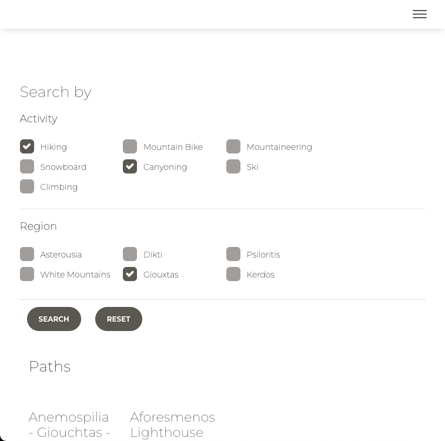
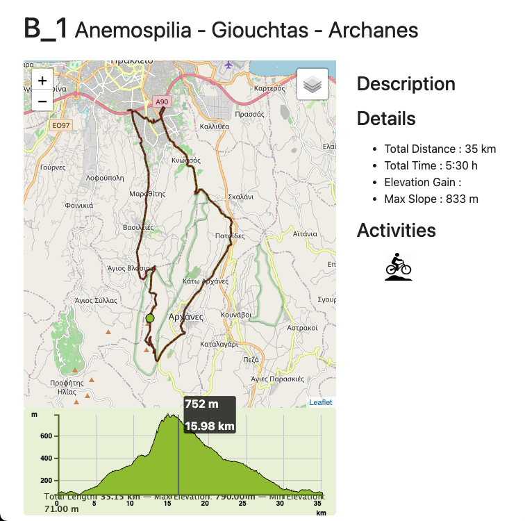
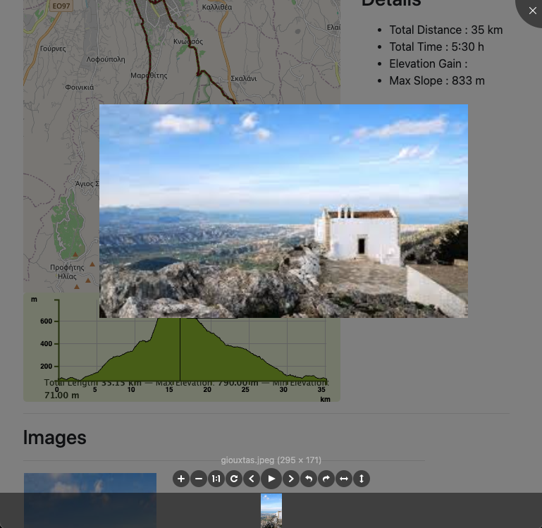

# Paths

**Paths** is a web application that allows users to display and explore routes in **GPX** and **KML** formats. It provides detailed information about the routes such as description, distance, and elevation, and visualizes them on a map with multiple layers. The app is multilingual and built using **JavaScript**, **HTML**, and **CSS**.

**Live Demo [here.](https://petrakis.info/Paths/)**

## Features

- **Display GPX and KML Routes**: Upload and visualize routes in GPX and KML formats.
- **Basic Route Details**: View descriptions, distance, and other route details.
- **Map with Multiple Layers**: Visualize routes on maps with support for different layers (e.g., satellite, terrain, street view).
- **Elevation Profile**: Show elevation data for the displayed route.
- **Multilingual Support**: Available in multiple languages for a wider user base.
- **Responsive Design**: Optimized for both desktop and mobile devices.

## Screenshots

## Technologies Used

* [jQuery](https://jquery.com/)
* [Bootstrap](https://getbootstrap.com/)
* [Leaflet](https://leafletjs.com/)
* [Paper Kit](https://github.com/creativetimofficial/paper-kit-2)
* [CouchDB](https://couchdb.apache.org/)
* [PouchDB](https://pouchdb.com/)

## Getting Started

### Prerequisites

To run **Paths** locally, you will need:

- A modern web browser (e.g., Chrome, Firefox, Edge)
- Optionally, a local web server to serve the files
- A running PathsAdmin backend (contact for more details)

### 2. Installation and deployment ###

Three simple steps: Clone - Deploy - Run.

1. Copy the project folder into the desired location. 

2. Deploy (drop the folder into your desired web appliction server (eg webapps for Apache Tomcat)).

3. Run 

## Configuration

This [configuration file](https://github.com/cpetrakis/Paths/blob/main/configuration/config.json) contains all the cofiguration that have to be done in order to deploy the tool

## Usage
Navigate the uploaded routes and paths
Apply your prefered filters in order to search acoording your preferences
Navigate and explore paths

## License
This project is licensed under the Apache-2.0 license - see the LICENSE file for details.

### 3. Contact ### 

Kostas Petrakis 

<petrakis1@gmail.com>
